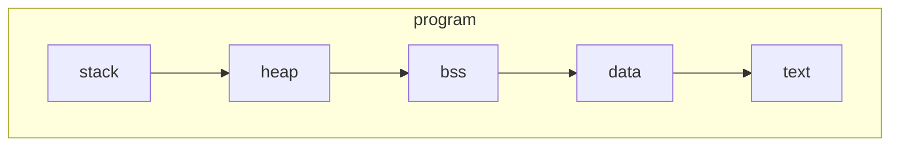

+++
date = "2022-02-20"
title = "Mechanics of an Assembly Program"
+++
# Mechanics of an Assembly Program

<!--  -->

<!--  --> 

What is the point of Assembly programs anyway? What do they actually do?
They turn into machine instructions for a particular CPU architecture.
The backend of almost any programming language, especially compiled programming langauges involves some sort of assembler/assembly language.

Is Assembly a programming language?
Not really... There are a handful of Assemblers and thus a handful of "Assembly Languages." Usually someone would refer to the assembler itself, such as [NASM](https://www.nasm.us/doc/nasmdocc.html) or TASM when referencing an assembly langauge, but you could also consider something like [LLVM IR](https://llvm.org/docs/LangRef.html) or [GNU RTL IR](https://gcc.gnu.org/onlinedocs/gccint/RTL.html) to be an assembly langauge.

The critical difference from an Assembly language to a typical programming language is that Assembly languages are very "low level" and provide very minimal abstractions over hardware. In order to directly write code in an assembly language, you need to know details about how the target CPU actually works. These days most CPUs involve concepts like "Registers" or "Program Counter", and so assembly langauges offer those absractions to the user.

High Level / Non-ASM Program
This is an example of a piece of code which has a high level of abstraction over the hardware, it deals with the concept of addition, and it deals with it in a way where you don't actually have to think about what the CPU is doing to accomplish it.
```c
int add(int a, int b) {
	return a + b;
}

int main() {
	return add(123, 456) // Output will be: 579
}
```

Low Level / ASM Program
```asm
section .data ; Data Segment
; Initialized Data is stored here, these are values you know ahead of time.

section .bss ; Memory Reservations - "Block Started by Symbol"
; Reservations in the BSS section are named locations in memory
; of a specified size.
; Data here is reserved but not "initialized", meaning
; it doesn't have values

section .text ; Code goes in the text section
global main ; Declare the Entrypoint for Linking
main:
	; Store 123 in the EAX Register
	mov eax,123 ; 32-bit Extended Accumulator
	; Store 456 in the EBX Register
	mov ebx,456 ; 32-bit Extended Base
	
	; Add the EAX and EBX registers together
	add eax,ebx ; Value is stored in ECX, 32-bit Extended Counter
	mov ecx,edx ; Move it to the 32-bit Data Register
	int 0x80 ; Processor Interrupt
ret
```

To be continued...
